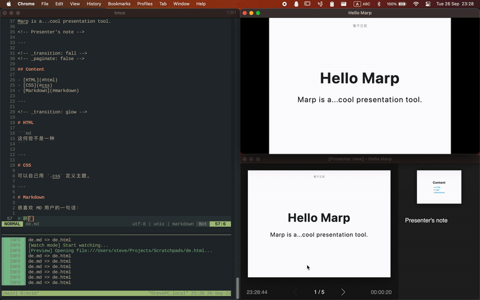

<!-- _paginate: false -->
<!-- _header: '' -->

# Markdown+

## 够简单，够实用

Markdown 简介及相关扩展工具推荐

---

## 选择 → 练习 → 精通

功能性、实用性、经济性、兼容性

---

### 选择

每个推荐看起来都很好？
看了许多测评也无法决定？
↓
缩减条目，快速找到合适的工具
练习精进，提高效率

---

## Markdown

**Markdown / MD** 是一款用于*格式化文本*的[标记语言](https://zh.wikipedia.org/wiki/置标语言)

```md
**Markdown / MD** 是一款用于*格式化文本*的[标记语言](https://zh.wikipedia.org/wiki/置标语言)
```

---

## 为什么用 Markdown？

- 容易阅读，图文格式转换灵活
- 方便编辑，学习成本极低
- 生态良好，各端效果大体统一

---

### 阅读 Markdown

```md
# 井号作为标题
Markdown 使用的标记不太影响阅读，甚至还能辅助阅读。  
*星号*指示**重点**，
- 短横杠则是列表中的一条
- 反引号标记`代码`
1. 数字给列表排序
2. [文本](www.可以嵌入链接.com)
```

---

### 编辑 Markdown

`.md` 可用任何文本编辑器编辑，并以纯文本形式编写


---

## 使用场景

易编辑、效果好、导出方便

<!-- _footer: Markdown 最初是为网页写作设计的 -->

---

### 内容创作

只需打字即可完成内容和排版，
无需点击功能图标或学习快捷键
适合专注内容的普通写作

---

### 笔记

编写简便，附加排版，无需额外配置
纯文本，体积小，何时何地何设备都可编辑
适合快速且精致的笔记和备忘录

<!-- _footer: 做科学类笔记时还得请出 LaTex block -->

---

### 网络博客

除了内容创作上的便利，
Markdown 原生支持 HTML 转换，还可导出为多种格式
适合网络博客的写作

<!-- _footer: 毕竟是为此而做的 -->

---

### 为什么不用 Markdown

- 灵活性受限（缩放、图表……）
- 无高级排版（学术写作、书籍……）
- 种类繁多（GFM、Pandoc、Julia……）

<!-- _footer: 能力是有限的 -->

---

## Markdown 与其他工具对比

使用场景与 Markdown 有重叠的工具

---

### Markdown & AsciiDoc & reStructuredText

| Markdown | ADOC | rST |
| - | - | - |
| 很简单 | 比较简单 | 略微复杂 |
| 功能有限 | 功能较多 | 功能繁多 |

---

### Markdown & 类 Word & Tex & Typst

| Markdown | Word/ODT/Pages | Tex/LaTex | Typst |
| - | - | - | - |
| 随意 | 专门的编辑器 | 随意 | 随意 |
| 很简单 | 易上手 | 比较复杂 | 易上手 |
| 功能有限 | 功能繁多 | 十分强大 | 功能繁多/开发中 |
| 纯文本 | 压缩包 | 纯文本 | 纯文本 |

<!-- _footer: 妈🔪我认得，乳胶太不洒脱 -->

---

## Markdown 工具箱

编辑、渲染、导出、转换、扩展……

本文不会介绍
需要用户使用 HTML、JS 等的工具

<!-- _footer: 因为我也不太会 -->

---

### 教程 & 文档

- [官中教程](https://markdown.com.cn)
- 丰富的图文/视频教程（B站……）
- 各个工具的文档
- ……

<!-- _footer: search the friendly web -->

---

### 编辑工具

| MD 编辑器 | MD 笔记软件 |
| - | - |
| 编辑以外的功能不多 | 笔记的管理与同步 |
| 主要为电脑端 | 遍布全端 |

选择困难？各看4款风格不同的工具

---

### 编辑器

支持 Markdown 高亮/预览/导出的编辑器

---

#### [MarkText](https://github.com/marktext/marktext/blob/develop/docs/i18n/zh_cn.md#readme)

- 开源免费（MIT）
- 易上手
- 支持 Windows、macOS 和 Linux
- 支持所见即所得
- 支持 LaTex 数学，Mermaid 图表和更多扩展
- 支持自定义 CSS 主题
- 无插件

---

#### [Typora](https://typora.io)

- 付费（买断制，15天试用）
- 易上手，简约精致
- 支持 Windows、macOS 和 Linux
- 支持所见即所得，LaTex 数学，Mermaid 图表和更多扩展
- 支持自定义 CSS 主题
- 无插件

---

#### [Visual Studio Code (VSC)](https://code.visualstudio.com/download)

- 开源免费（MIT）
- 易上手，有汉化插件，插件功能强大
- 支持 Windows、macOS 和 Linux，有网页版
- 自带一定 MD 支持，也可以使用 MD 插件实现各类功能

<!-- _footer: VSC，年轻人的第一款文本浏览器 -->

---

#### [Neovim](https://github.com/neovim/neovim) / [Vim](https://github.com/vim/vim)

- 开源免费（Apache 2.0 / VIM ）
- 较难上手，需配置
- 支持 Windows、macOS 和 Linux，移动端则较难使用
- 支持高度自定义
- 插件丰富，功能强大

<!-- _footer: 现在我要说一款键位很怪的老牌编辑器 -->

---

### 笔记软件

使用 Markdown，有笔记功能整合的软件

---
#### [Simplenote](https://simplenote.com/)（笔记软件）

- 开源免费（GPL 2.0）
- 易上手，简约设计，有链接功能
- 支持 Windows、macOS、Linux、iOS 和安卓
- 默认云存储，强制同步，也支持本地存储

---

#### [Obsidian](https://obsidian.md)（笔记软件）

- 开源，免费+增值（Freemium），增值部分主要为商用证书和云存储服务
- 易上手，有双向链接和独特的关系图功能
- 支持 Windows、macOS、Linux、iOS 和安卓
- 支持所见即所得，LaTex 数学和 Callout
- 支持插件

<!-- _footer: Vimwiki GUI Pro -->

---

#### [Joplin](https://joplinapp.org/cn/)（笔记软件）

- 开源免费（AGPL-3.0）
- 易上手，内置一定的云存储支持（OneDrive 等）
- 支持 Windows、macOS、Linux、iOS 和安卓
- 支持所见即所得，LaTex 数学和 Mermaid 图表
- 支持插件
- 使用独有文件格式，但可导出为 MD、PDF 等格式

---

#### [Notion](https://www.notion.so)（笔记软件）

- 免费+增值（Freemium）
- 易上手，Markdown 以外的功能多
- 支持 Windows、macOS、Linux、iOS 和安卓，有网页版
- 默认云存储，可以导出，但导入导出支持差
- 主要为团队管理和商业项目服务

---

### 幻灯片 / 演示文稿

Markdown 也可用于创建美观的幻灯片
相较于 PPT 等 Office 工具，
Markdown 幻灯片通常功能较少，但制作简单

---

#### [Marp](https://marp.app)

- 开源免费（MIT）
- 易上手，纯 MD 和少量 HTML（注释）即可
- 支持 Windows、macOS、Linux，有 CLI 和 VSC 插件
- 需要 Node.js
- 可导出为 PDF、HTML、PNG、JEPG 和 PPTX
- 支持自定义 CSS 主题，实时预览和转场动画（需要 Chrome 内核浏览器）

<!-- _footer: 这份幻灯片……？ -->

---

<!-- _header: '' -->



---

### 转换工具

有时需要将 Markdown 转为其他格式，
比如 PDF 方便阅读，亦或者 LaTex 继续进行排版

---

#### 在线转换工具

- 需要网络
- 数据不一定安全
- 支持多种格式
- 操作比较省心

---

#### Pandoc

- 较难上手
- 功能强大，支持非常多种格式
- 本地运行，无需网络
- 有网页版

<!-- _footer: _Interview With Pandoc Enthusiast_ -->

---

### 转换路径

- MD → LaTex → PDF

    简单转换可行，但碰上中文等复杂情况比较麻烦

- MD → HTML → PNG（网页截图）

    对自定义格式支持较好，
    前提是有合适的 HTML 模版和 CSS

- MD → Typst → PDF

    操作简单，但目前模版较少

