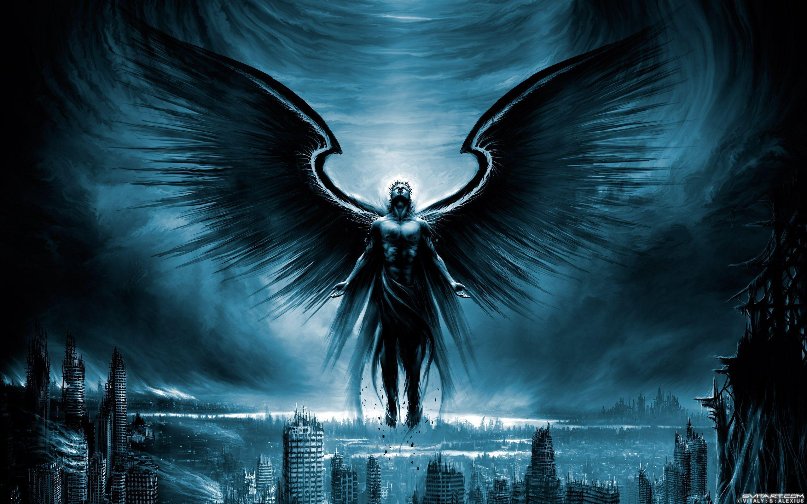

<!-- _paginate: false -->
<!-- _footer: '' -->

# The Black Angel

Collected in _Music Percussive_,
authored by Yu Guangzhong in 1966.

    In its original (Chinese) version, readers can jump from
     a stanza ('paragraph' of poems) to another
     <strong>at random</strong> while keeping the pace and being sensible.

    I guess the English grammar just screwed it up, you try make it better maybe?

---

<!-- _paginate: hold -->

Swift swoops down the Black Angel
From night’s innermost navel,
From a sky of setting moon and crows
When wolves are tearing the crescent
And swarms of rats are nibbling at

---

The remaining star-crumbs. I am
The Angel of Ill Omen
Who descends at the worst moment
With an obituary telegram
To bang your door and call you up

---

From amidst your
    nightmares and sweat.
Among all angels alone I’m black,
An outlaw to every angel white,
And on every black list, long or short,
Most conspicuous you never miss

---

My name, marked
    BLACK ANGEL. I am
The black angel cruising at night
Through the darkest, the most opaque
Blindness of a moonless,
    dawnless night
I never discovered
    the best camouflaged

---

Of evils but will circle over its head
To watch for its last breath of sin
And rush all of a sudden down
Upon its death long overdue,
For I am the Black Angel
    who never flies

---

But by himself through
    lightnings and rain.
To tell the grown­ups fairy tales,
To tell them that God never fails,
The white angels are
    more than well­paid.
But I am, with a high price
    on my head,

---

The Arch-Assassin none can stop
From breaking through the draperies
And rings of guards,
    from where the night
Is at its most deaf and blind,
    from outside
The Dark Tower overhanging
    the Dark Lord:

---

Where the Black Angel strikes, I strike.

---

<!-- _paginate: false -->
<!-- _header: '' -->
<!-- _footer: '' -->

